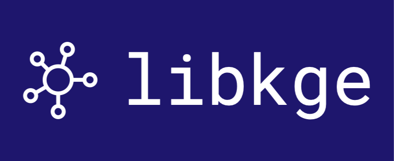

LibKGE is a library for knowledge graph embedding models.

[](https://requires.io/github/samehkamaleldin/libkge/requirements/?branch=master)

## Installation
The library is tested and guaranteed to work on both linux and mac.

#### System requirements
- Linux (CPU and GPU) and MacOS (CPU only)
- Python 3.5

#### Python environments
We strongly recommend that you use a conda virtual environment for working with the library. You can initialise a new conda enviroment for the library as follows:
``` bash
conda create --name libkge python=3.5
source activate libkge
```

#### Requirements installation
You acn install the requirements using the installation script as follows:
``` bash
sh install.sh
```
#### Tensorflow installation
The `libkge` library supports tensorflow 1.x versions. We recommend that you install `tensorflow=1.13.1` for cpu usage and `tensorflow-gpu=1.13.1` for GPU support.
You can install tensorflow by uncommenting the relevant line (cpu or gpu) or by running the following commands:
``` bash
# for cpu usage
conda install tensorflow=1.13.1
``` 
for cpu usage, and for the GPU support you can use the following:
``` bash
# for gpu usage
conda install tensorflow-gpu=1.13.1
``` 

#### Install the `libkge` library
You can install the library from the github repository using the following commands:
``` bash
git clone https://github.com/samehkamaleldin/libkge.git
cd libkge
python setup.py install
```
 
 
## Quick example
You can run a quick example using the model pipeline example file as follows:
 ``` bash
# while you are in the libkge directory
cd examples
python kge_model_pipeline.py
```

You can edit the content of the `kge_model_pipeline.py` file to change the model parameters and other model and data configurations.

## Contributions

#### Source code abbreviations
In this project we use a set of abbreviations as prefixes and suffixes in naming variables.  These abbreviations are listed as follows:
``` txt
- em    : embeddings
- nb    : number or count
- rnd   : random
- ent   : entity
- rel   : relation
- map   : mapping
- reg   : regularisation
- param : parameter
- lr    : learning rate
- neg   : negative
- negs  : negatives
- corr  : corruption
- corrs : corruptions
- vec   : vector
- pt    : pointwise
- pr    : pairwise
- mx    : matrix
- rs    : random state
- img   : imaginary
- src   : source
- val   : value
- wt    : weight
- dest  : destination
- var   : variable
- tf    : tensorflow
```
